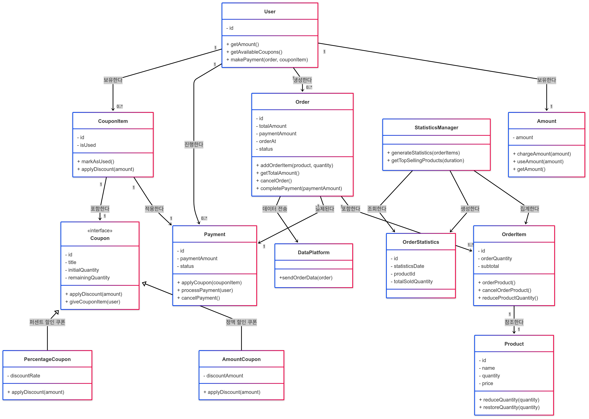

## E-Commerce 프로젝트

## Getting Started

### Prerequisites

#### Running Docker Containers

`local` profile 로 실행하기 위하여 인프라가 설정되어 있는 Docker 컨테이너를 실행해주셔야 합니다.

```bash
docker-compose up -d
```

## 프로젝트 설명
- `e-커머스 상품 주문 서비스`를 구현해 봅니다.
- 상품 주문에 필요한 메뉴 정보들을 구성하고 조회가 가능해야 합니다.
- 사용자는 상품을 여러개 선택해 주문할 수 있고, 미리 충전한 잔액을 이용합니다.
- 상품 주문 내역을 통해 판매량이 가장 높은 상품을 추천합니다.

## 요구사항
1️⃣ **`주요`** **잔액 충전 / 조회 API**

- 결제에 사용될 금액을 충전하는 API 를 작성합니다.
- 사용자 식별자 및 충전할 금액을 받아 잔액을 충전합니다.
- 사용자 식별자를 통해 해당 사용자의 잔액을 조회합니다.

2️⃣ **`기본` 상품 조회 API**

- 상품 정보 ( ID, 이름, 가격, 잔여수량 ) 을 조회하는 API 를 작성합니다.
- 조회시점의 상품별 잔여수량이 정확하면 좋습니다.

3️⃣  **`주요` 선착순 쿠폰 기능**

- 선착순 쿠폰 발급 API 및 보유 쿠폰 목록 조회 API 를 작성합니다.
- 사용자는 선착순으로 할인 쿠폰을 발급받을 수 있습니다.
- 주문 시에 유효한 할인 쿠폰을 함께 제출하면, 전체 주문금액에 대해 할인 혜택을 부여받을 수 있습니다.

4️⃣ **`주요`** **주문 / 결제 API**

- 사용자 식별자와 (상품 ID, 수량) 목록을 입력받아 주문하고 결제를 수행하는 API 를 작성합니다.
- 결제는 기 충전된 잔액을 기반으로 수행하며 성공할 시 잔액을 차감해야 합니다.
- 데이터 분석을 위해 결제 성공 시에 실시간으로 주문 정보를 데이터 플랫폼에 전송해야 합니다.


5️⃣  **`기본` 상위 상품 조회 API**

- 최근 3일간 가장 많이 팔린 상위 5개 상품 정보를 제공하는 API 를 작성합니다.
- 통계 정보를 다루기 위한 기술적 고민을 충분히 해보도록 합니다.

## 클래스 다이어그램
- User: 사용자가 보유한 잔액과 쿠폰을 관리하고, 주문을 및 결제를 생성합니다.
- Amount: 잔액을 충전하고, 사용합니다.
- Product: 상품의 정보를 저장하고 재고를 차감하고, 복구합니다.
- Order: 주문 항목을 생성하고, 주문 금액을 관리합니다.
- OrderItem : 상품의 재고 차감시키고, 복구시킵니다.
- Payment : 주문 금액에 쿠폰을 적용시키고, 사용자에게 최종 결제 금액을 기반으로 결제를 요청합니다
- Coupon : 쿠폰명, 초기 수량, 잔여 수량과 같은 기본 정보를 관리, 주문 금액에 쿠폰을 적용시킵니다.
- PercentCoupon, AmountCoupon : 쿠폰 할인 방식 정액 할인과 비율 할인으로 나누어 구체화 하였습니다.
- CouponItem: 사용자가 발급받은 쿠폰을 관리, 결제에서 쿠폰을 적용, 쿠폰 사용 여부를 관리합니다.
- OrderStatistics : 일별 상품의 판매량 정보를 가지고 있습니다.
- StatisticsManager : 주문 내역을 기반으로 주문 통계를 생성하고, 주문 통계를 기반으로 인기 판매 정보를 반환합니다.



## ERD


## 상태 다이어그램
사용자가 주문을 생성하고, 주문 결과를 반환받을 때까지의 상태 변화에 대한 다이어그램입니다.

