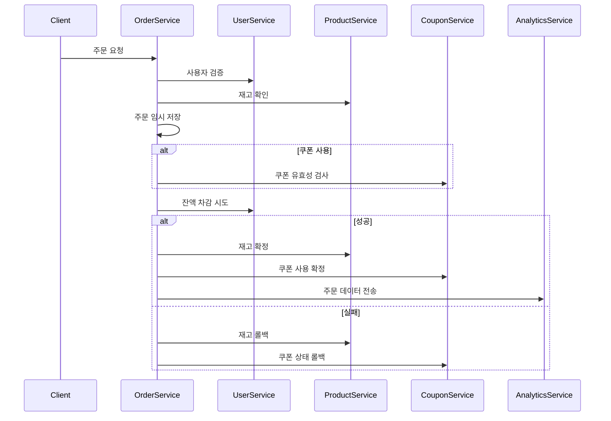

## MSA 분리 전략 보고서 개선안

### 1. **도메인 분리 기준**

#### 1.1 핵심 원칙

- **독립적 라이프사이클**: 생성/변경/삭제 주기가 다른 도메인 분리
- **트랜잭션 경계**: 동일 트랜잭션이 필요한 도메인 집합화
- **비즈니스 중요도**: 주문-결제 도메인의 장애 영향도 고려

#### 1.2 배포 단위

| 서비스명            | 포함 도메인         | 분리 근거                     |
|-----------------|----------------|---------------------------|
| User Service    | User           | 독립적인 회원 정보 관리 주기          |
| Product Service | Product        | 상품 정보 변경 주기가 주문과 무관       |
| Coupon Service  | Coupon         | 쿠폰 발급/사용 주기 독립성           |
| Order Service   | Order, Payment | 주문 생성 → 결제 처리의 강한 트랜잭션 결합 |

### 2. **데이터 정합성 전략**

#### 2.1 기본 원칙

✅ **물리적 트랜잭션**: 단일 서비스 내 작업(잔액 충전, 상품 조회 등)  
✅ **Saga 패턴**: 주문-결제 프로세스의 분산 트랜잭션 관리

#### 2.2 보상 트랜잭션 매트릭스

| 실패 지점    | 보상 액션            | 대상 서비스          |
|----------|------------------|-----------------|
| 쿠폰 적용 실패 | 상품 수량 복구         | Product         |
| 잔액 부족    | 상품 수량 복구 + 쿠폰 롤백 | Product, Coupon |
| 시스템 장애   | 타임아웃 기반 자동 복구    | 전체              |

### 3. **주문-결제 흐름 개선안**

#### 3.1 시퀀스 다이어그램 핵심 개선점



#### 3.2 주요 변경 사항 설명

1. **결제 서비스 분리 제거**: 주문 도메인이 결제 흐름을 주도하도록 단순화
2. **임시 저장 단계 추가**: 보상 트랜잭션을 위한 상태 관리 강화
3. **분석 서비스 추가**: 이벤트 기반 비동기 처리로 성능 개선

### 4. **결론**

```
라이프사이클 기반 서비스 분리를 통해 확장성과 유지보수성을 개선하면서도, 
Saga 패턴을 활용해 복잡한 주문-결제 흐름의 데이터 정합성을 유지할 수 있는 구조를 제안합니다.
```
