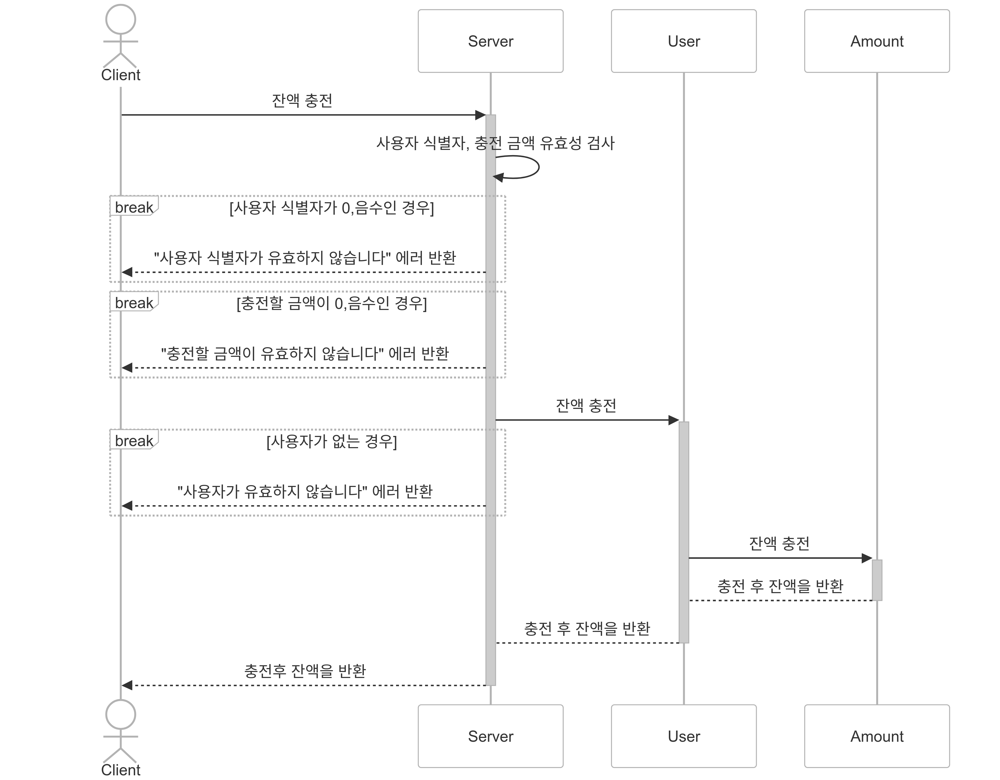
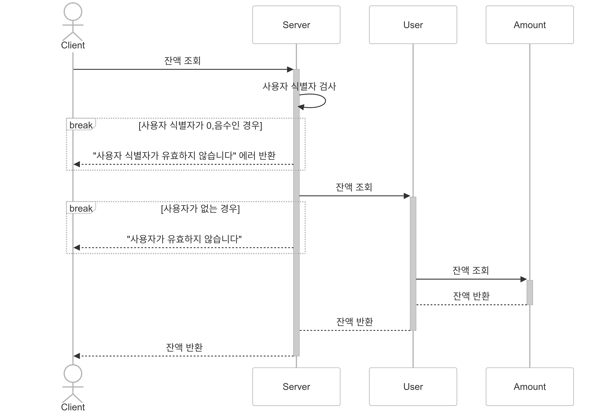
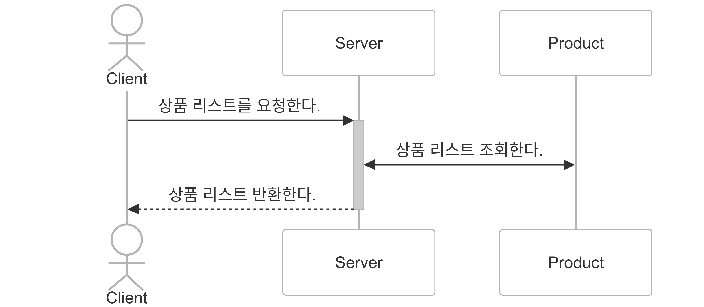
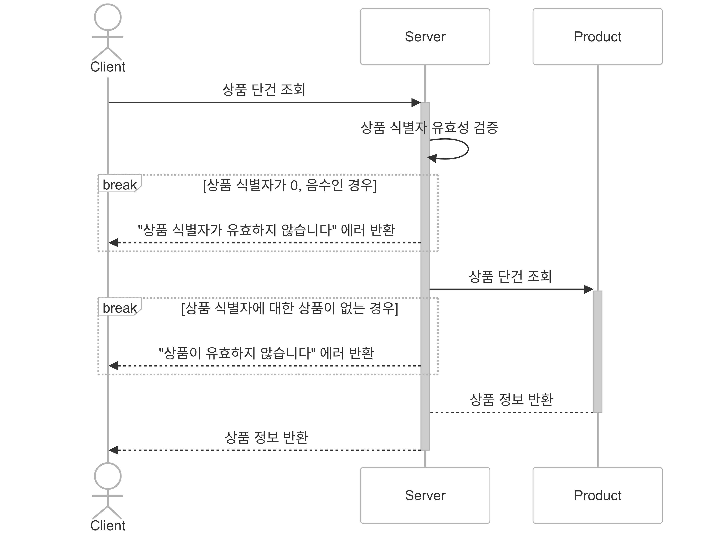
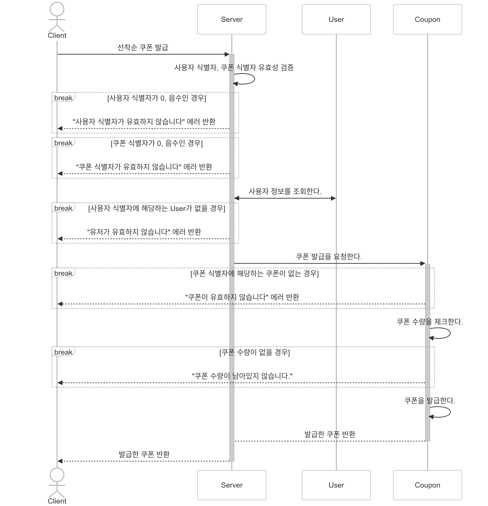
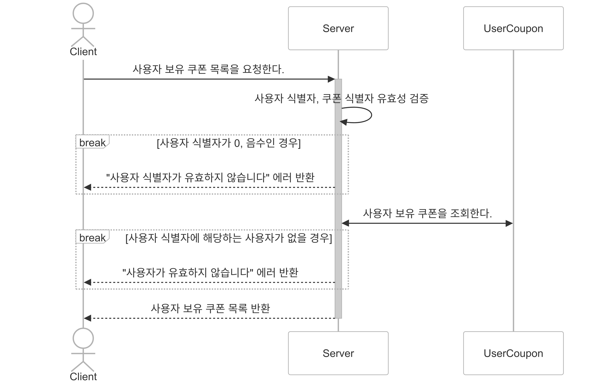
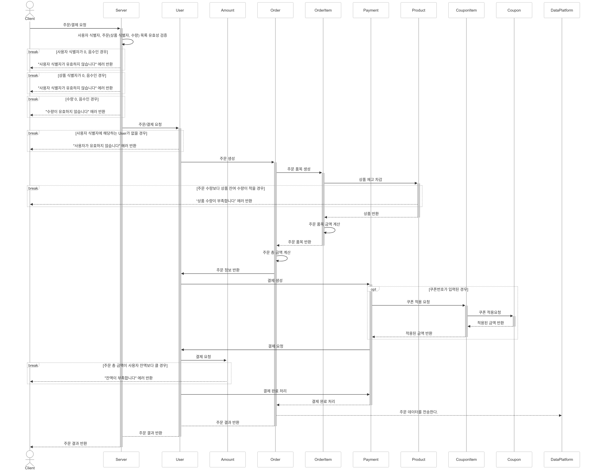
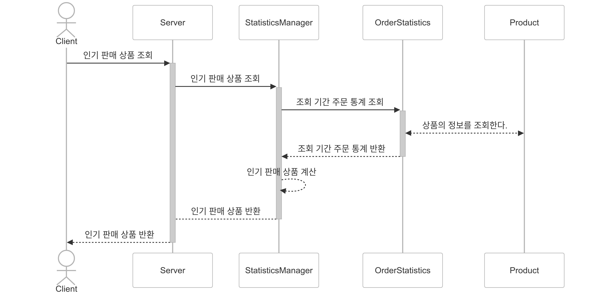
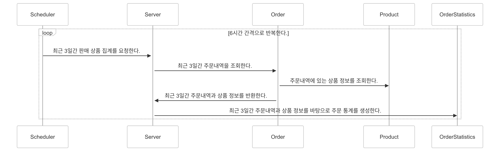

# 시퀀스 다이어그램
API & 기능 별 시나리오 기반으로 작성한 시퀀스 다이어그램입니다.

## 잔액 충전 기능
사용자가 잔액을 충전하는 기능에 대한 시퀀스 다이어그램입니다.

## 잔액 조회 기능
사용자가 잔액을 조회하는 기능에 대한 시퀀스 다이어그램입니다.

## 상품 리스트 조회 기능
사용자가 상품 리스트를 조회하는 기능에 대한 시퀀스 다이어그램입니다.

## 상품 단건 조회 기능
사용자가 상품 단건 정보를 조회하는 기능에 대한 시퀀스 다이어그램입니다.

## 선착순 쿠폰 발급 기능
사용자가 선착순 쿠폰을 발급하는 기능에 대한 시퀀스 다이어그램입니다.

## 보유 쿠폰 조회 기능
사용자가 보유 쿠폰을 조회하는 기능에 대한 시퀀스 다이어그램입니다.

## 주문 & 결제 기능
사용자가 상품을 주문하고 결제하는 기능에 대한 시퀀스 다이어그램입니다.

## 인기 판매 상품 조회 기능
사용자가 인기 판매 상품을 조회하는 기능에 대한 시퀀스 다이어그램입니다.

## 주문 통계 생성 기능
당일 주문 내역을 통계로 생성해주는 기능에 대한 시퀀스 다이어그램입니다.

