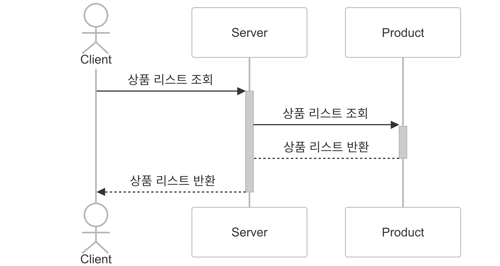
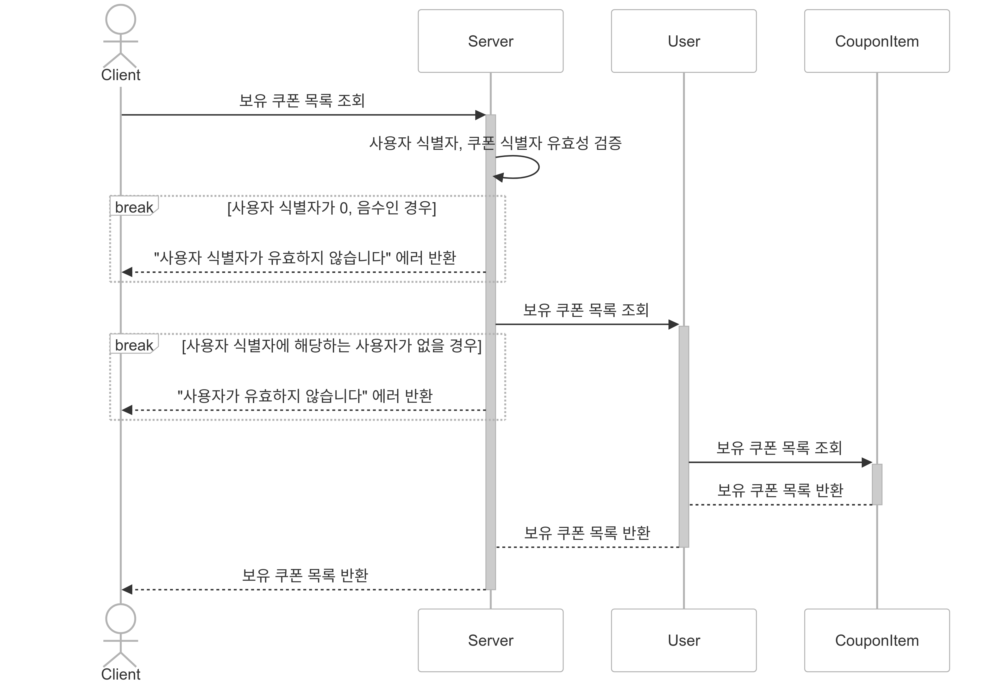

# 시퀀스 다이어그램
API & 기능 별 시나리오 기반으로 작성한 시퀀스 다이어그램입니다.

## 시퀀스 다이어그램 Actor & Participant
- Client : 기능을 요청하는 Actor 입니다.
- Server : Client 요청을 받아 비즈니스 로직을 처리합니다.
- User : 사용자 정보, 사용자 잔액, 사용자 보유 쿠본 등의 정보를 관리하는 사용자도메인입니다.
- Product : 상품의 정보, 가격, 옵션별 수량 정보를 관리하는 상품 도메인입니다.
- Coupon : 쿠폰의 정보, 수량, 할인 옵션, 할인 가격등의 정보를 관리하는 쿠폰 도메인입니다.
- Order : 사용자가 상품을 주문할 때, 주문한 상품, 수량, 주문 총 금액 등의 정보를 관리하는 주문도메인입니다.
- DataPlatform : 주문 데이터 분석을 위한 외부 플랫폼입니다.
- OrderStatistics : 주문 내역을 기반으로 통계 정보를 생성해주는 주문 통계 도메인입니다.

## 잔액 충전 기능
사용자가 잔액을 충전하는 기능에 대한 시퀀스 다이어그램입니다.

## 잔액 조회 기능
사용자가 잔액을 조회하는 기능에 대한 시퀀스 다이어그램입니다.

## 상품 리스트 조회 기능
사용자가 상품 리스트를 조회하는 기능에 대한 시퀀스 다이어그램입니다.

## 상품 단건 조회 기능
사용자가 상품 단건 정보를 조회하는 기능에 대한 시퀀스 다이어그램입니다.

## 선착순 쿠폰 발급 기능
사용자가 선착순 쿠폰을 발급하는 기능에 대한 시퀀스 다이어그램입니다.

## 보유 쿠폰 조회 기능
사용자가 보유 쿠폰을 조회하는 기능에 대한 시퀀스 다이어그램입니다.

## 주문 & 결제 기능
사용자가 상품을 주문하고 결제하는 기능에 대한 시퀀스 다이어그램입니다.

## 인기 판매 상품 조회 기능
사용자가 인기 판매 상품을 조회하는 기능에 대한 시퀀스 다이어그램입니다.

## 주문 통계 생성 기능
사용자가 상품 리시트를 조회하는 기능에 대한 시퀀스 다이어그램입니다.

