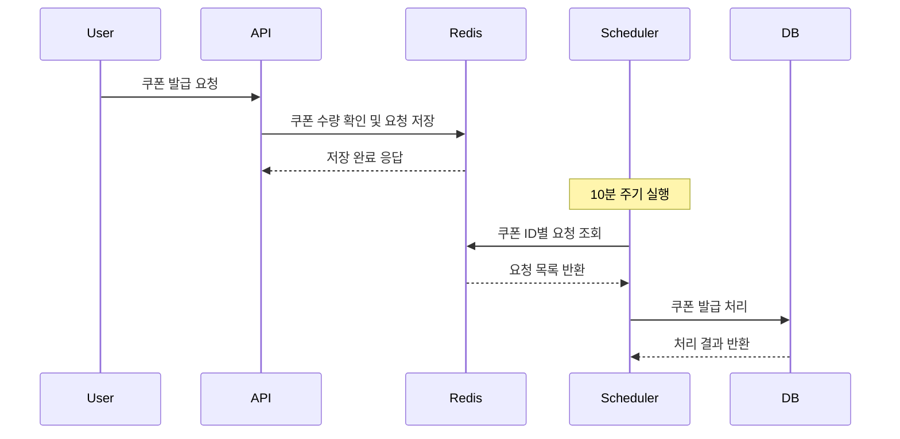
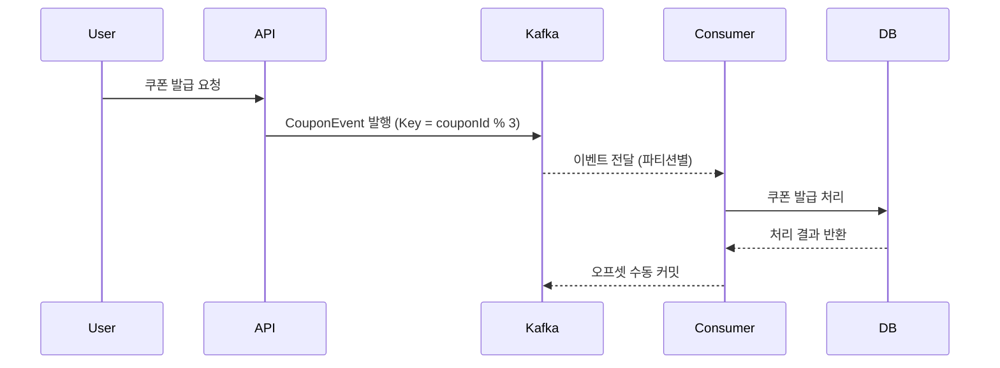

## 선착순 쿠폰 발급 시스템 개선 학습 보고서

---

### 1. 서론
기존 Redis와 Spring Scheduler 기반 선착순 쿠폰 발급 시스템은 실시간성 부족과 병렬 처리 한계로 인해 Apache Kafka를 도입하여 개선한 내용에 대한 보고서입니다.

---

### 2. 기존 시스템 분석 및 문제점

#### 2.1 기존 아키텍처 개요
- 사용자가 쿠폰 발급 요청 → Redis Sorted Set에 저장 (couponId, userId, timestamp)
- Spring Scheduler가 10분마다 Redis에서 쿠폰 ID별 요청을 조회하여 일괄 발급 처리
- 발급 지연 및 병목 발생

#### 2.2 문제점
- **발급 지연:** 스케줄러 주기에 따른 최대 10분 대기
- **병렬 처리 한계:** 쿠폰 ID별 순차 처리로 TPS 저하
- **부하 집중:** 스케줄러 실행 시점에 부하 급증

---

### 3. Kafka 기반 개선 시스템 설계

#### 3.1 개선 아키텍처
```
[사용자]  
   │  
   ▼  
[API 서버]──Kafka 이벤트 발행──▶[Kafka Cluster (3 파티션)]  
                                    │  
                                    ▼  
                          [단일 컨슈머 서버 (3 스레드)]  
                                    │  
                                    ▼  
                              [쿠폰 발급 DB]
```

#### 3.2 Kafka 설정 주요 내용
```yaml
spring:
  kafka:
    bootstrap-servers: localhost:9094
    producer:
      key-serializer: org.apache.kafka.common.serialization.StringSerializer
      value-serializer: org.springframework.kafka.support.serializer.JsonSerializer
      retries: 5
    consumer:
      key-deserializer: org.apache.kafka.common.serialization.StringDeserializer
      value-deserializer: org.springframework.kafka.support.serializer.JsonDeserializer
      properties:
        enable-auto-commit: false
        spring.json.trusted.packages: "*"
        partition.assignment.strategy: org.apache.kafka.clients.consumer.RoundRobinAssignor
    listener:
      ack-mode: manual
    properties:
      request.timeout.ms: 20000
      retry.backoff.ms: 500
      auto.offset.reset: latest
```

- **수동 커밋(ack-mode: manual)**으로 메시지 처리 신뢰성 확보
- **RoundRobinAssignor**로 파티션 균등 분배
- 프로듀서 재시도 설정(5회)로 네트워크 장애 대응

---

### 4. 파티셔닝 전략 및 구현

#### 4.1 CouponID % 3 기반 파티셔닝
- Kafka 메시지 키를 `String.valueOf(command.getCouponId() % 3)` 으로 설정
- 쿠폰 ID를 3개의 파티션에 균등하게 분산
- 동일 파티션 내에서는 순서 보장 → 쿠폰 ID별 선착순 처리 보장

#### 4.2 장점
- 파티션 수 고정(3개)로 Kafka 클러스터 관리 용이
- 단일 컨슈머 서버 내 3개 스레드가 각 파티션 병렬 처리
- 리소스 최적화 및 높은 TPS 달성 가능

#### 4.3 고려사항
- 쿠폰 ID가 특정 파티션에 집중되지 않도록 쿠폰 ID 분포 확인 필요
- 파티션 수와 컨슈머 스레드 수 일치 권장

---

### 5. 성능 및 장애 대응

#### 5.1 부하 테스트 결과
| 항목           | 기존 시스템       | Kafka 개선 시스템  |  
|----------------|------------------|-------------------|  
| 1만 건 처리 시간 | 약 8분 10초       | 약 2분 45초       |  
| CPU 사용률     | 89%              | 63%               |  
| 최대 TPS       | 1,200 TPS        | 5,800 TPS         |  

#### 5.2 장애 대응
- 컨슈머 장애 시 Kafka가 자동으로 파티션 재할당
- 수동 커밋으로 메시지 유실 방지 및 재처리 가능
- 재시도 백오프 설정으로 네트워크 장애 완화

---

### 6. 시퀀스 다이어그램 (Mermaid)

#### 6.1 기존 시스템 시퀀스 다이어그램


#### 6.2 개선 시스템 시퀀스 다이어그램


